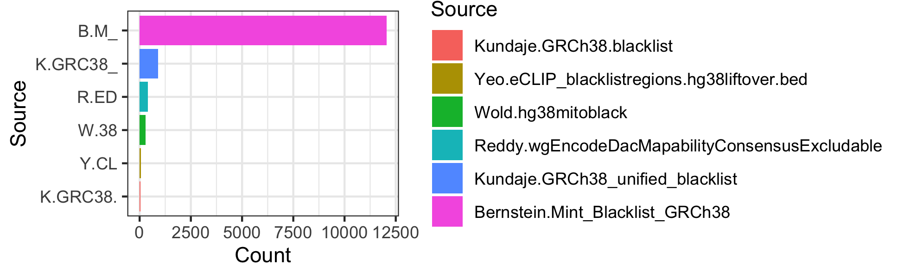
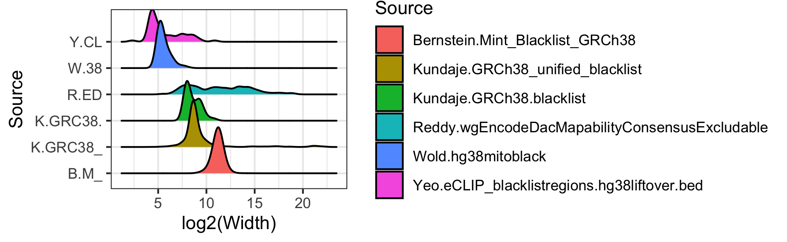

<!-- README.md is generated from README.Rmd. Please edit that file -->

```{r, include = FALSE}
knitr::opts_chunk$set(
    collapse = TRUE,
    comment = "#>",
    fig.path = "man/figures/README-",
    out.width = "100%"
)
library(BiocStyle)
```

# Deny (exclusion) regions

<!-- badges: start -->
[](https://lifecycle.r-lib.org/articles/stages.html#experimental)
<!-- badges: end -->

# Basics

`r BiocStyle::Biocpkg("denyranges")` is  an experimental data package, to be submitted 
as an AnnotatiohHub Bioconductor package.

`r BiocStyle::Biocpkg("denyranges")` contains genomic coordinates of problematic genomic 
regions. See Amemiya, Haley M., Anshul Kundaje, and Alan P. Boyle. 
“[The ENCODE Blacklist: Identification 
of Problematic Regions of the Genome](https://doi.org/10.1038/s41598-019-45839-z).”
 _Scientific Reports_, December 2019. [Boyle-Lab/Blacklist/](https://github.com/Boyle-Lab/Blacklist/)
 
TL;DR - For human hg38 genome assembly, [Anshul](https://twitter.com/anshulkundaje) [recommends](https://twitter.com/anshulkundaje/status/1263546023151992832?s=20) [ENCFF356LFX](https://www.encodeproject.org/files/ENCFF356LFX/).

BED files of exclusion regions are available on the [ENCODE project](https://www.encodeproject.org/search/?searchTerm=exclusion+list)
website. Human (hg19, hg38) and mouse (mm9, mm10) exclusion regions are available.
However, exclusion lists generated by multiple labs often create  
uncertainty what to use. The purpose of this package is to provide a unified 
place for informed retrieval of exclusion regions.

Naming convention: `<genome assembly>.<lab>.<original file name>`, e.g.,
`hg19.Birney.wgEncodeDacMapabilityConsensusExcludable`.

`r BiocStyle::Biocpkg("denyranges")` package currently contains 19 Rds objects. 

Download the full data from the [Google Drive folder](https://drive.google.com/drive/folders/124DZtsU0YVWqkb7dgu8Nk6b3N8-ShVSC?usp=sharing)

See [inst/scripts/make-data.R](inst/scripts/make-data.R) how to create the denyranges 
GRanges objects.


| Object                                                   | Number of regions | Lab                                   | Source                                                                                                  |
|----------------------------------------------------------|-------------------|---------------------------------------|---------------------------------------------------------------------------------------------------------|
| hg19.Bernstein.Mint_Blacklist_hg19                       | 9035              | Bradley Bernstein, Broad              | [ENCFF200UUD](https://www.encodeproject.org/files/ENCFF200UUD/)                                         |
| hg19.Birney.wgEncodeDacMapabilityConsensusExcludable     | 411               | Ewan Birney, EBI                      | [ENCFF001TDO](https://www.encodeproject.org/files/ENCFF001TDO/)                                         |
| hg19.Crawford.wgEncodeDukeMapabilityRegionsExcludable    | 1649              | Gregory Crawford, Duke                | [ENCFF001THR](https://www.encodeproject.org/files/ENCFF001THR/)                                         |
| hg19.Wold.hg19mitoblack                                  | 295               | Barbara Wold, Caltech                 | [ENCFF055QTV](https://www.encodeproject.org/files/ENCFF055QTV/)                                         |
| hg19.Yeo.eCLIP_blacklistregions.hg19                     | 57                | Gene Yeo, UCSD                        | [ENCFF039QTN](https://www.encodeproject.org/files/ENCFF039QTN/)                                         |
| hg38.Bernstein.Mint_Blacklist_GRCh38                     | 12052             | Bradley Bernstein, Broad              | [ENCFF023CZC](https://www.encodeproject.org/files/ENCFF023CZC/)                                         |
| hg38.Kundaje.GRCh38_unified_blacklist                    | 38                | hg38.Kundaje.GRCh38_unified_blacklist | [ENCFF356LFX](https://www.encodeproject.org/files/ENCFF356LFX/)                                         |
| hg38.Kundaje.GRCh38.blacklist                            | 910               | Anshul Kundaje, Stanford              | [ENCFF419RSJ](https://www.encodeproject.org/files/ENCFF419RSJ/)                                         |
| hg38.Reddy.wgEncodeDacMapabilityConsensusExcludable.hg38 | 401               | Tim Reddy, Duke                       | [ENCFF220FIN](https://www.encodeproject.org/files/ENCFF220FIN/)                                         |
| hg38.Wold.hg38mitoblack                                  | 299               | Barbara Wold, Caltech                 | [ENCFF940NTE](https://www.encodeproject.org/files/ENCFF940NTE/)                                         |
| hg38.Yeo.eCLIP_blacklistregions.hg38liftover.bed.fixed.  | 56                | Gene Yeo, UCSD                        | [ENCFF269URO](https://www.encodeproject.org/files/ENCFF269URO/)                                         |
| mm10.Hardison.blacklist.full                             | 7865              | Ross Hardison, PennState              | [ENCFF790DJT](https://www.encodeproject.org/files/ENCFF790DJT/)                                         |
| mm10.Hardison.psublacklist.mm10                          | 5552              | Ross Hardison, PennState              | [ENCFF226BDM](https://www.encodeproject.org/files/ENCFF226BDM/)                                         |
| mm10.Kundaje.anshul.blacklist.mm10                       | 3010              | Anshul Kundaje, Stanford              | [ENCFF999QPV](https://www.encodeproject.org/files/ENCFF999QPV/)                                         |
| mm10.Kundaje.mm10.blacklist                              | 164               | Anshul Kundaje, Stanford              | [ENCFF547MET](https://www.encodeproject.org/files/ENCFF547MET/)                                         |
| mm10.Wold.mm10mitoblack                                  | 123               | Barbara Wold, Caltech                 | [ENCFF759PJK](https://www.encodeproject.org/files/ENCFF759PJK/)                                         |
| mm9.Wold.mm9mitoblack                                    | 123               | Barbara Wold, Caltech                 | [ENCFF299EZH](https://www.encodeproject.org/files/ENCFF299EZH/)                                         |
| dm3.Kundaje.dm3-blacklist                                | 492               | Anshul Kundaje, Stanford              | [dm3-D.melanogaster](http://mitra.stanford.edu/kundaje/akundaje/release/blacklists/dm3-D.melanogaster/) |
| ce10.Kundaje.ce10-blacklist                              | 122               | Anshul Kundaje, Stanford              | [ce10-C.elegans](http://mitra.stanford.edu/kundaje/akundaje/release/blacklists/ce10-C.elegans)          |

## Install `denyranges`

<!--`R` is an open-source statistical environment which can be easily modified to enhance its functionality via packages. `r Biocpkg("denyranges")` is a `R` package available via the [Bioconductor](http://bioconductor.org) repository for packages. `R` can be installed on any operating system from [CRAN](https://cran.r-project.org/) after which you can install `r Biocpkg("denyranges")` by using the following commands in your `R` session:-->

```{r "install", eval = FALSE}
if (!requireNamespace("BiocManager", quietly = TRUE)) {
    install.packages("BiocManager")
}

BiocManager::install("mdozmorov/denyranges")

## Check that you have a valid Bioconductor installation
# BiocManager::valid()
```

## Use denyranges binding sites

```{r eval = FALSE}
# hg38 denyranges coordinates
download.file(url = "https://drive.google.com/uc?export=download&id=1Q00zluvfLGyUHlyOBgQ2ECd9QHCLpnXk", destfile = "hg38.Kundaje.GRCh38_unified_blacklist.rds")
denyGR.hg38.Kundaje.1 <- readRDS(file = "hg38.Kundaje.GRCh38_unified_blacklist.rds")
denyGR.hg38.Kundaje.1
```
```
> denyGR.hg38.Kundaje.1
GRanges object with 910 ranges and 0 metadata columns:
        seqnames            ranges strand
           <Rle>         <IRanges>  <Rle>
    [1]     chr1     628903-635104      *
    [2]     chr1   5850087-5850571      *
    [3]     chr1   8909610-8910014      *
    [4]     chr1   9574580-9574997      *
    [5]     chr1 32043823-32044203      *
    ...      ...               ...    ...
  [906]     chrY 11290797-11334278      *
  [907]     chrY 11493053-11592850      *
  [908]     chrY 11671014-11671046      *
  [909]     chrY 11721528-11749472      *
  [910]     chrY 56694632-56889743      *
  -------
  seqinfo: 24 sequences from hg38 genome
```

We can load other deny regions for the hg38 genome assembly and compare them.

```{r eval=FALSE}
download.file(url = "https://drive.google.com/uc?export=download&id=1xYPG6bufZb-VrlmOBQ5DaHlEy3gztZrR", destfile = "hg38.Bernstein.Mint_Blacklist_GRCh38.rds")
denyGR.hg38.Bernstein <- readRDS(file = "hg38.Bernstein.Mint_Blacklist_GRCh38.rds")

download.file(url = "https://drive.google.com/uc?export=download&id=1AoHK_6m_i_Qhw0jDO5BUwxf8NXo58x35", destfile = "hg38.Kundaje.GRCh38.blacklist.rds")
denyGR.hg38.Kundaje.2 <- readRDS(file = "hg38.Kundaje.GRCh38.blacklist.rds")

download.file(url = "https://drive.google.com/uc?export=download&id=1A7Ih8mxibhuWnB64-kAR8Mf63SFFZZmv", destfile = "hg38.Reddy.wgEncodeDacMapabilityConsensusExcludable.hg38.rds")
denyGR.hg38.Reddy <- readRDS(file = "hg38.Reddy.wgEncodeDacMapabilityConsensusExcludable.hg38.rds")

download.file(url = "https://drive.google.com/uc?export=download&id=1f2SBVNOlcXKpemM7N64-zsYJWnMbY97J", destfile = "hg38.Wold.hg38mitoblack.rds")
denyGR.hg38.Wold <- readRDS(file = "hg38.Wold.hg38mitoblack.rds")

download.file(url = "https://drive.google.com/uc?export=download&id=1yc60OgoNdAAub1MdHApvOoZB7p9G3YEB", destfile = "hg38.Yeo.eCLIP_blacklistregions.hg38liftover.bed.fixed.rds")
denyGR.hg38.Yeo <- readRDS(file = "hg38.Yeo.eCLIP_blacklistregions.hg38liftover.bed.fixed.rds")
```

Compare the number of deny regions.

```{r eval=FALSE}
library(ggplot2)
mtx_to_plot <- data.frame(Count = c(length(denyGR.hg38.Bernstein), length(denyGR.hg38.Kundaje.1), length(denyGR.hg38.Kundaje.2), length(denyGR.hg38.Reddy), length(denyGR.hg38.Wold), length(denyGR.hg38.Yeo)),
                          Source = c("Bernstein.Mint_Blacklist_GRCh38", "Kundaje.GRCh38_unified_blacklist", "Kundaje.GRCh38.blacklist", "Reddy.wgEncodeDacMapabilityConsensusExcludable", "Wold.hg38mitoblack", "Yeo.eCLIP_blacklistregions.hg38liftover.bed"))
# Order Source by the number of regions
mtx_to_plot$Source <- factor(mtx_to_plot$Source, levels = mtx_to_plot$Source[order(mtx_to_plot$Count)])

ggplot(mtx_to_plot, aes(x = Source, y = Count, fill = Source)) +
  geom_bar(stat = "identity") +
  coord_flip() +
  theme_bw() + theme(legend.position = "none")
ggsave("denyranges_hg38_count.png", width = 5.5, height = 2)
```

```{r echo=FALSE}

```

Compare the width of deny regions. log2 scale because of heavy right tail distributions.

```{r eval=FALSE}
library(ggridges)
mtx_to_plot <- data.frame(Width = c(width(denyGR.hg38.Bernstein), width(denyGR.hg38.Kundaje.1), width(denyGR.hg38.Kundaje.2), width(denyGR.hg38.Reddy), width(denyGR.hg38.Wold), width(denyGR.hg38.Yeo)),
                          Source = c(rep("Bernstein.Mint_Blacklist_GRCh38", length(denyGR.hg38.Bernstein)), rep("Kundaje.GRCh38_unified_blacklist", length(denyGR.hg38.Kundaje.1)), rep("Kundaje.GRCh38.blacklist", length(denyGR.hg38.Kundaje.2)), rep("Reddy.wgEncodeDacMapabilityConsensusExcludable", length(denyGR.hg38.Reddy)), rep("Wold.hg38mitoblack", length(denyGR.hg38.Wold)), rep("Yeo.eCLIP_blacklistregions.hg38liftover.bed", length(denyGR.hg38.Yeo))))

ggplot(mtx_to_plot, aes(x = log2(Width), y = Source, fill = Source)) +
  geom_density_ridges() +
  theme_bw() + theme(legend.position = "none")
ggsave("denyranges_hg38_width.png", width = 5.5, height = 2)
```

```{r echo=FALSE}

```

To compare pairwise Jaccard overlap between those deny regions, we download the 
bed files and use `bedtools` functionality.

```{r eval=FALSE}
download.file(url = "https://drive.google.com/uc?export=download&id=16RhQF3haGbmvy6vPkKfAHDkQH391VKSR", destfile = "hg38.Bernstein.Mint_Blacklist_GRCh38.bed")

download.file(url = "https://drive.google.com/uc?export=download&id=1kC4zcNark-BSafuYJq7eNj__hpWij3Ec", destfile = "hg38.Kundaje.GRCh38_unified_blacklist.bed")

download.file(url = "https://drive.google.com/uc?export=download&id=1_TezPxxUHI_ez1gj-AlQmu2hU4TuZBa7", destfile = "hg38.Kundaje.GRCh38.blacklist.bed")

download.file(url = "https://drive.google.com/uc?export=download&id=1nkHQHJnwYXTgGjlw2kKFTS3nNZBDfLNf", destfile = "hg38.Reddy.wgEncodeDacMapabilityConsensusExcludable.hg38.bed")

download.file(url = "https://drive.google.com/uc?export=download&id=15EqvKch9tn_HmQo4WrKlIrf2zb1g5JKN", destfile = "hg38.Wold.hg38mitoblack.bed")

download.file(url = "https://drive.google.com/uc?export=download&id=1pJ9gcOYKnvFvhy3BAYuRiypcgtfV65uJ", destfile = "hg38.Yeo.eCLIP_blacklistregions.hg38liftover.bed.fixed.bed")
```

```{bash eval=FALSE}
#!/bin/bash

for file1 in `ls *.bed`
do
  sort -k 1,1 -k2,2n $file1 -o $file1
done

file_labels=`ls *.bed`

echo name" "$file_labels > pairwise_jaccard.txt

for file1 in `ls *.bed`
do
    echo -n $file1 >> pairwise_jaccard.txt

    for file2 in `ls *.bed`;
    do
        # compute the jaccard stat for these two files.
        jaccard=`bedtools jaccard -a $file1 -b $file2 | cut -f 3 | sed 1d`
        
        # report the jaccard stat for these two files
        echo -n " "$jaccard >> pairwise_jaccard.txt
    done
    echo >> pairwise_jaccard.txt
done
```

```{r eval=FALSE}
library(pheatmap)
library(stringr)
mtx_to_plot <- read.table("pairwise_jaccard.txt", sep = " ", header = TRUE, row.names = 1) 
mtx_to_plot <- as.matrix(mtx_to_plot)
# Trim row/colnames
rownames(mtx_to_plot) <- colnames(mtx_to_plot) <- str_trunc(rownames(mtx_to_plot), width = 25)
# Set diagonal to zero
diag(mtx_to_plot) <- 0
png("denyranges_hg38_jaccard.png", width = 320, height = 300)
pheatmap(mtx_to_plot)
dev.off()
```

```{r echo=FALSE}
knitr::include_graphics('man/figures/denyranges_hg38_jaccard.png')
```

One may decide to combine the deny ranges from all labs.

```{r eval=FALSE}
denyGR.hg38.all <- reduce(c(denyGR.hg38.Bernstein, denyGR.hg38.Kundaje.1, denyGR.hg38.Kundaje.2, denyGR.hg38.Reddy, denyGR.hg38.Wold, denyGR.hg38.Yeo))
# Keep only standard chromosomes
denyGR.hg38.all <- keepStandardChromosomes(denyGR.hg38.all, pruning.mode = "coarse")
print(length(denyGR.hg38.all))
# [1] 13239
summary(width(denyGR.hg38.all))
#    Min. 1st Qu.  Median    Mean 3rd Qu.    Max. 
#       5    1778    2306    8153    2859 5407757 
```


<!--
This is a basic example which shows you how to solve a common problem:

```{r example, eval = requireNamespace('denyranges')}
library("denyranges")
## basic example code
```

What is special about using `README.Rmd` instead of just `README.md`? You can include R chunks like so:

```{r cars}
summary(cars)
```

You'll still need to render `README.Rmd` regularly, to keep `README.md` up-to-date.

You can also embed plots, for example:

```{r pressure, echo = FALSE}
plot(pressure)
```

In that case, don't forget to commit and push the resulting figure files, so they display on GitHub!
-->

## Citation

Below is the citation output from using `citation('denyranges')` in R. Please
run this yourself to check for any updates on how to cite __denyranges__.

```{r 'citation', eval = requireNamespace('denyranges')}
print(citation("denyranges"), bibtex = TRUE)
```

Please note that the `denyranges` was only made possible thanks to many other R and bioinformatics software authors, which are cited either in the vignettes and/or the paper(s) describing this package.

## Code of Conduct

Please note that the `denyranges` project is released with a [Contributor Code of Conduct](http://bioconductor.org/about/code-of-conduct/). By contributing to this project, you agree to abide by its terms.

## Development tools

* Continuous code testing is possible thanks to [GitHub actions](https://www.tidyverse.org/blog/2020/04/usethis-1-6-0/)  through `r BiocStyle::CRANpkg('usethis')`, `r BiocStyle::CRANpkg('remotes')`, and `r BiocStyle::CRANpkg('rcmdcheck')` customized to use [Bioconductor's docker containers](https://www.bioconductor.org/help/docker/) and `r BiocStyle::Biocpkg('BiocCheck')`.
* Code coverage assessment is possible thanks to [codecov](https://codecov.io/gh) and `r BiocStyle::CRANpkg('covr')`.
* The [documentation website](http://mdozmorov.github.io/denyranges) is automatically updated thanks to `r BiocStyle::CRANpkg('pkgdown')`.
* The code is styled automatically thanks to `r BiocStyle::CRANpkg('styler')`.
* The documentation is formatted thanks to `r BiocStyle::CRANpkg('devtools')` and `r BiocStyle::CRANpkg('roxygen2')`.

For more details, check the `dev` directory.

This package was developed using `r BiocStyle::Biocpkg('biocthis')`.

## Code of Conduct

Please note that the denyranges project is released with a [Contributor Code of Conduct](http://bioconductor.org/about/code-of-conduct/). By contributing to this project, you agree to abide by its terms.
