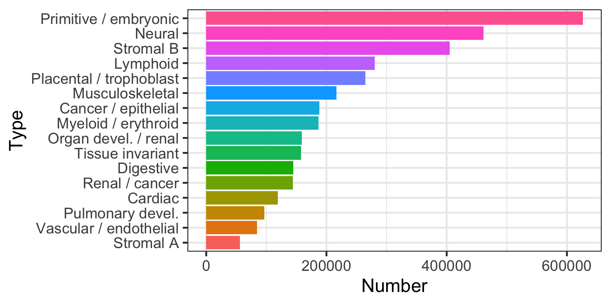

<!-- README.md is generated from README.Rmd. Please edit that file -->

# Deny (exclusion) regions

<!-- badges: start -->

[](https://lifecycle.r-lib.org/articles/stages.html#experimental)
<!-- badges: end -->

# Basics

*[denyranges](https://bioconductor.org/packages/3.12/denyranges)* is an
experimental data package, to be submitted as an AnnotatiohHub
Bioconductor package.

*[denyranges](https://bioconductor.org/packages/3.12/denyranges)*
contains genomic coordinates of problematic genomic regions. See
Amemiya, Haley M., Anshul Kundaje, and Alan P. Boyle. “[The ENCODE
Blacklist: Identification of Problematic Regions of the
Genome](https://doi.org/10.1038/s41598-019-45839-z).” *Scientific
Reports*, December 2019.
[Boyle-Lab/Blacklist/](https://github.com/Boyle-Lab/Blacklist/)

TL;DR - For human hg38 genome assembly,
[Anshul](https://twitter.com/anshulkundaje)
[recommends](https://twitter.com/anshulkundaje/status/1263546023151992832?s=20)
[ENCFF356LFX](https://www.encodeproject.org/files/ENCFF356LFX/).

BED files of exclusion regions are available on the [ENCODE
project](https://www.encodeproject.org/search/?searchTerm=exclusion+list)
website. Human (hg19, hg38) and mouse (mm9, mm10) exclusion regions are
available. However, exclusion lists generated by multiple labs often
create  
uncertainty what to use. The purpose of this package is to provide a
unified place for informed retrieval of exclusion regions.

Naming convention: `<genome assembly>.<lab>.<original file name>`, e.g.,
`hg19.Birney.wgEncodeDacMapabilityConsensusExcludable`.

*[denyranges](https://bioconductor.org/packages/3.12/denyranges)*
package currently contains 19 Rds objects.

Download the full data from the [Google Drive
folder](https://drive.google.com/drive/folders/124DZtsU0YVWqkb7dgu8Nk6b3N8-ShVSC?usp=sharing)

See [inst/scripts/make-data.R](inst/scripts/make-data.R) how to create
the denyranges GRanges objects.

| Object                                                       | Number of regions | Assembly | Lab                      | Number of columns | Source                                                                                                  |
|--------------------------------------------------------------|-------------------|----------|--------------------------|-------------------|---------------------------------------------------------------------------------------------------------|
| ce10.Kundaje.ce10-blacklist.rds                              | 122               | ce10     | Anshul Kundaje, Stanford | 3                 | [ce10-C.elegans](http://mitra.stanford.edu/kundaje/akundaje/release/blacklists/ce10-C.elegans)          |
| dm3.Kundaje.dm3-blacklist.rds                                | 492               | dm3      | Anshul Kundaje, Stanford | 3                 | [dm3-D.melanogaster](http://mitra.stanford.edu/kundaje/akundaje/release/blacklists/dm3-D.melanogaster/) |
| hg19.Bernstein.Mint\_Blacklist\_hg19.rds                     | 9035              | hg19     | Bradley Bernstein, Broad | 6                 | [ENCFF200UUD](https://www.encodeproject.org/files/ENCFF200UUD/)                                         |
| hg19.Birney.wgEncodeDacMapabilityConsensusExcludable.rds     | 411               | hg19     | Ewan Birney, EBI         | 6                 | [ENCFF001TDO](https://www.encodeproject.org/files/ENCFF001TDO/)                                         |
| hg19.Crawford.wgEncodeDukeMapabilityRegionsExcludable.rds    | 1649              | hg19     | Gregory Crawford, Duke   | 6                 | [ENCFF001THR](https://www.encodeproject.org/files/ENCFF001THR/)                                         |
| hg19.Wold.hg19mitoblack.rds                                  | 295               | hg19     | Barbara Wold, Caltech    | 3                 | [ENCFF055QTV](https://www.encodeproject.org/files/ENCFF055QTV/)                                         |
| hg19.Yeo.eCLIP\_blacklistregions.hg19.rds                    | 57                | hg19     | Gene Yeo, UCSD           | 6                 | [ENCFF039QTN](https://www.encodeproject.org/files/ENCFF039QTN/)                                         |
| hg38.Bernstein.Mint\_Blacklist\_GRCh38.rds                   | 12052             | hg38     | Bradley Bernstein, Broad | 6                 | [ENCFF023CZC](https://www.encodeproject.org/files/ENCFF023CZC/)                                         |
| hg38.Kundaje.GRCh38.blacklist.rds                            | 38                | hg38     | Anshul Kundaje, Stanford | 3                 | [ENCFF356LFX](https://www.encodeproject.org/files/ENCFF356LFX/)                                         |
| hg38.Kundaje.GRCh38\_unified\_blacklist.rds                  | 910               | hg38     | Anshul Kundaje, Stanford | 3                 | [ENCFF419RSJ](https://www.encodeproject.org/files/ENCFF419RSJ/)                                         |
| hg38.Reddy.wgEncodeDacMapabilityConsensusExcludable.hg38.rds | 401               | hg38     | Tim Reddy, Duke          | 6                 | [ENCFF220FIN](https://www.encodeproject.org/files/ENCFF220FIN/)                                         |
| hg38.Wold.hg38mitoblack.rds                                  | 299               | hg38     | Barbara Wold, Caltech    | 3                 | [ENCFF940NTE](https://www.encodeproject.org/files/ENCFF940NTE/)                                         |
| hg38.Yeo.eCLIP\_blacklistregions.hg38liftover.bed.fixed.rds  | 56                | hg38     | Gene Yeo, UCSD           | 6                 | [ENCFF269URO](https://www.encodeproject.org/files/ENCFF269URO/)                                         |
| mm10.Hardison.blacklist.full.rds                             | 7865              | mm10     | Ross Hardison, PennState | 3                 | [ENCFF790DJT](https://www.encodeproject.org/files/ENCFF790DJT/)                                         |
| mm10.Hardison.psublacklist.mm10.rds                          | 5552              | mm10     | Ross Hardison, PennState | 3                 | [ENCFF226BDM](https://www.encodeproject.org/files/ENCFF226BDM/)                                         |
| mm10.Kundaje.anshul.blacklist.mm10.rds                       | 3010              | mm10     | Anshul Kundaje, Stanford | 3                 | [ENCFF999QPV](https://www.encodeproject.org/files/ENCFF999QPV/)                                         |
| mm10.Kundaje.mm10.blacklist.rds                              | 164               | mm10     | Anshul Kundaje, Stanford | 3                 | [ENCFF547MET](https://www.encodeproject.org/files/ENCFF547MET/)                                         |
| mm10.Wold.mm10mitoblack.rds                                  | 123               | mm10     | Barbara Wold, Caltech    | 3                 | [ENCFF759PJK](https://www.encodeproject.org/files/ENCFF759PJK/)                                         |
| mm9.Wold.mm9mitoblack.rds                                    | 123               | mm9      | Barbara Wold, Caltech    | 3                 | [ENCFF299EZH](https://www.encodeproject.org/files/ENCFF299EZH/)                                         |

## Install `denyranges`

<!--`R` is an open-source statistical environment which can be easily modified to enhance its functionality via packages. *[denyranges](https://bioconductor.org/packages/3.12/denyranges)* is a `R` package available via the [Bioconductor](http://bioconductor.org) repository for packages. `R` can be installed on any operating system from [CRAN](https://cran.r-project.org/) after which you can install *[denyranges](https://bioconductor.org/packages/3.12/denyranges)* by using the following commands in your `R` session:-->

``` r
if (!requireNamespace("BiocManager", quietly = TRUE)) {
    install.packages("BiocManager")
}

BiocManager::install("mdozmorov/denyranges")

## Check that you have a valid Bioconductor installation
# BiocManager::valid()
```

## Use denyranges binding sites

``` r
# hg38 denyranges coordinates
download.file(url = "https://drive.google.com/uc?export=download&id=1Q00zluvfLGyUHlyOBgQ2ECd9QHCLpnXk", destfile = "hg38.Kundaje.GRCh38_unified_blacklist.rds")
denyGR.hg38.Kundaje.1 <- readRDS(file = "hg38.Kundaje.GRCh38_unified_blacklist.rds")
denyGR.hg38.Kundaje.1
```

    > denyGR.hg38.Kundaje.1
    GRanges object with 910 ranges and 0 metadata columns:
            seqnames            ranges strand
               <Rle>         <IRanges>  <Rle>
        [1]     chr1     628903-635104      *
        [2]     chr1   5850087-5850571      *
        [3]     chr1   8909610-8910014      *
        [4]     chr1   9574580-9574997      *
        [5]     chr1 32043823-32044203      *
        ...      ...               ...    ...
      [906]     chrY 11290797-11334278      *
      [907]     chrY 11493053-11592850      *
      [908]     chrY 11671014-11671046      *
      [909]     chrY 11721528-11749472      *
      [910]     chrY 56694632-56889743      *
      -------
      seqinfo: 24 sequences from hg38 genome

We can load other deny regions for the hg38 genome assembly and compare
them.

``` r
download.file(url = "https://drive.google.com/uc?export=download&id=1xYPG6bufZb-VrlmOBQ5DaHlEy3gztZrR", destfile = "hg38.Bernstein.Mint_Blacklist_GRCh38.rds")
denyGR.hg38.Bernstein <- readRDS(file = "hg38.Bernstein.Mint_Blacklist_GRCh38.rds")

download.file(url = "https://drive.google.com/uc?export=download&id=1AoHK_6m_i_Qhw0jDO5BUwxf8NXo58x35", destfile = "hg38.Kundaje.GRCh38.blacklist.rds")
denyGR.hg38.Kundaje.2 <- readRDS(file = "hg38.Kundaje.GRCh38.blacklist.rds")

download.file(url = "https://drive.google.com/uc?export=download&id=1A7Ih8mxibhuWnB64-kAR8Mf63SFFZZmv", destfile = "hg38.Reddy.wgEncodeDacMapabilityConsensusExcludable.hg38.rds")
denyGR.hg38.Reddy <- readRDS(file = "hg38.Reddy.wgEncodeDacMapabilityConsensusExcludable.hg38.rds")

download.file(url = "https://drive.google.com/uc?export=download&id=1f2SBVNOlcXKpemM7N64-zsYJWnMbY97J", destfile = "hg38.Wold.hg38mitoblack.rds")
denyGR.hg38.Wold <- readRDS(file = "hg38.Wold.hg38mitoblack.rds")

download.file(url = "https://drive.google.com/uc?export=download&id=1yc60OgoNdAAub1MdHApvOoZB7p9G3YEB", destfile = "hg38.Yeo.eCLIP_blacklistregions.hg38liftover.bed.fixed.rds")
denyGR.hg38.Yeo <- readRDS(file = "hg38.Yeo.eCLIP_blacklistregions.hg38liftover.bed.fixed.rds")
```

Compare the number of deny regions.

``` r
library(ggplot2)
mtx_to_plot <- data.frame(Count = c(length(denyGR.hg38.Bernstein), 
                                    length(denyGR.hg38.Kundaje.1), 
                                    length(denyGR.hg38.Kundaje.2), 
                                    length(denyGR.hg38.Reddy), 
                                    length(denyGR.hg38.Wold), 
                                    length(denyGR.hg38.Yeo)),
                          Source = c("Bernstein.Mint_Blacklist_GRCh38", 
                                     "Kundaje.GRCh38_unified_blacklist", 
                                     "Kundaje.GRCh38.blacklist", 
                                     "Reddy.wgEncodeDacMapabilityConsensusExcludable", 
                                     "Wold.hg38mitoblack", 
                                     "Yeo.eCLIP_blacklistregions.hg38liftover.bed"))
# Order Source by the number of regions
mtx_to_plot$Source <- factor(mtx_to_plot$Source, levels = mtx_to_plot$Source[order(mtx_to_plot$Count)])

ggplot(mtx_to_plot, aes(x = Source, y = Count, fill = Source)) +
  geom_bar(stat = "identity") +
  coord_flip() +
  theme_bw() + theme(legend.position = "none")
ggsave("denyranges_hg38_count.png", width = 5.5, height = 2)
```


Compare the width of deny regions. log2 scale because of heavy right
tail distributions.

``` r
library(ggridges)
mtx_to_plot <- data.frame(Width = c(width(denyGR.hg38.Bernstein), 
                                    width(denyGR.hg38.Kundaje.1), 
                                    width(denyGR.hg38.Kundaje.2), 
                                    width(denyGR.hg38.Reddy), 
                                    width(denyGR.hg38.Wold), 
                                    width(denyGR.hg38.Yeo)),
                          Source = c(rep("Bernstein.Mint_Blacklist_GRCh38", length(denyGR.hg38.Bernstein)),
                                     rep("Kundaje.GRCh38_unified_blacklist", length(denyGR.hg38.Kundaje.1)),
                                     rep("Kundaje.GRCh38.blacklist", length(denyGR.hg38.Kundaje.2)),
                                     rep("Reddy.wgEncodeDacMapabilityConsensusExcludable", length(denyGR.hg38.Reddy)),
                                     rep("Wold.hg38mitoblack", length(denyGR.hg38.Wold)),
                                     rep("Yeo.eCLIP_blacklistregions.hg38liftover.bed", length(denyGR.hg38.Yeo))))

ggplot(mtx_to_plot, aes(x = log2(Width), y = Source, fill = Source)) +
  geom_density_ridges() +
  theme_bw() + theme(legend.position = "none")
ggsave("denyranges_hg38_width.png", width = 5.5, height = 2)
```


We can investigate the total width of each set of deny ranges.

``` r
mtx_to_plot <- data.frame(TotalWidth = c(sum(width(denyGR.hg38.Bernstein)), 
                                         sum(width(denyGR.hg38.Kundaje.1)), 
                                         sum(width(denyGR.hg38.Kundaje.2)), 
                                         sum(width(denyGR.hg38.Reddy)), 
                                         sum(width(denyGR.hg38.Wold)), 
                                         sum(width(denyGR.hg38.Yeo))), 
                          Source = c("Bernstein.Mint_Blacklist_GRCh38", 
                                     "Kundaje.GRCh38_unified_blacklist", 
                                     "Kundaje.GRCh38.blacklist", 
                                     "Reddy.wgEncodeDacMapabilityConsensusExcludable", 
                                     "Wold.hg38mitoblack", 
                                     "Yeo.eCLIP_blacklistregions.hg38liftover"))
ggplot(mtx_to_plot, aes(x = TotalWidth, y = Source, fill = Source)) + 
  geom_bar(stat="identity") + scale_x_log10() + scale_y_discrete(label=abbreviate) +
  xlab("log10 total width")
ggsave("denyranges_hg38_sumwidth.png", width = 6.5, height = 2)
```


We can compare Jaccard overlap between those sets of deny regions.

``` r
library(pheatmap)
library(stringr)
# Jaccard calculations
jaccard <- function(gr_a, gr_b) {
  intersects <- intersect(gr_a, gr_b, ignore.strand = TRUE)
  intersection <- sum(width(intersects))
  union <- sum(width(union(gr_a, gr_b, ignore.strand = TRUE)))
  DataFrame(intersection, union, 
            jaccard = intersection/union,
             n_intersections = length(intersects))
}
# List and names of all deny regions
all_denyGR_list <- list(denyGR.hg38.Bernstein, 
                        denyGR.hg38.Kundaje.1, 
                        denyGR.hg38.Kundaje.2,
                        denyGR.hg38.Reddy,
                        denyGR.hg38.Wold,
                        denyGR.hg38.Yeo)
all_denyGR_name <- c("Bernstein.Mint_Blacklist_GRCh38", 
                     "Kundaje.GRCh38_unified_blacklist", 
                     "Kundaje.GRCh38.blacklist", 
                     "Reddy.wgEncodeDacMapabilityConsensusExcludable", 
                     "Wold.hg38mitoblack", 
                     "Yeo.eCLIP_blacklistregions.hg38liftover")
# Correlation matrix, empty
mtx_to_plot <- matrix(data = 0, nrow = length(all_denyGR_list), ncol = all_denyGR_list)
# Fill it in
for (i in 1:length(all_denyGR_list)) {
  for (j in 1:length(all_denyGR_list)) {
    # If diagonal, set to zero
    if (i == j) mtx_to_plot[i, j] <- 0
    # Process only one half, the other is symmetric
    if (i > j) {
      mtx_to_plot[i, j] <- mtx_to_plot[j, i] <- jaccard(all_denyGR_list[[i]], all_denyGR_list[[j]])[["jaccard"]]
    }
  }
}
# Trim row/colnames
rownames(mtx_to_plot) <- colnames(mtx_to_plot) <- str_trunc(all_denyGR_name, width = 25) 
# Save the plot
png("denyranges_hg38_jaccard.png", width = 320, height = 300)
pheatmap(data.matrix(mtx_to_plot))
dev.off()
```


Note that some deny ranges objects contain six columns, implying there
may be some interesting metadata. Let’s explore one.

``` r
mcols(denyGR.hg38.Reddy)
mtx_to_plot <- as.data.frame(table(mcols(denyGR.hg38.Reddy)[["name"]]))
colnames(mtx_to_plot) <- c("Type", "Number")
mtx_to_plot <- mtx_to_plot[order(mtx_to_plot$Number), ]
mtx_to_plot$Type <- factor(mtx_to_plot$Type, levels = mtx_to_plot$Type)
ggplot(mtx_to_plot, aes(x = Number, y = Type, fill = Type)) +
  geom_bar(stat="identity") +
  theme_bw() + theme(legend.position = "none")
ggsave("denyranges_hg38_Reddy_metadata.png", width = 5, height = 2.5)
```



One may decide to combine the deny ranges from all labs, although from
previous results we may decide to follow Anshul’s
[advice](https://twitter.com/anshulkundaje/status/1263546023151992832?s=20)
[ENCFF356LFX](https://www.encodeproject.org/files/ENCFF356LFX/) and use
the `denyGR.hg38.Kundaje.1` object.

``` r
denyGR.hg38.all <- reduce(c(denyGR.hg38.Bernstein, denyGR.hg38.Kundaje.1, denyGR.hg38.Kundaje.2, denyGR.hg38.Reddy, denyGR.hg38.Wold, denyGR.hg38.Yeo))
# Keep only standard chromosomes
denyGR.hg38.all <- keepStandardChromosomes(denyGR.hg38.all, pruning.mode = "coarse")
print(length(denyGR.hg38.all))
# [1] 13239
summary(width(denyGR.hg38.all))
#    Min. 1st Qu.  Median    Mean 3rd Qu.    Max. 
#       5    1778    2306    8153    2859 5407757 
```

## Citation

Below is the citation output from using `citation('denyranges')` in R.
Please run this yourself to check for any updates on how to cite
**denyranges**.

``` r
print(citation("denyranges"), bibtex = TRUE)
#> 
#> Dozmorov MG (2021). _denyranges_.
#> https://github.com/mdozmorov/denyranges/denyranges - R package version
#> 0.99.0, <URL: https://github.com/mdozmorov/denyranges>.
#> 
#> A BibTeX entry for LaTeX users is
#> 
#>   @Manual{,
#>     title = {denyranges},
#>     author = {Mikhail G. Dozmorov},
#>     year = {2021},
#>     url = {https://github.com/mdozmorov/denyranges},
#>     note = {https://github.com/mdozmorov/denyranges/denyranges - R package version 0.99.0},
#>   }
```

Please note that the `denyranges` was only made possible thanks to many
other R and bioinformatics software authors, which are cited either in
the vignettes and/or the paper(s) describing this package.

## Code of Conduct

Please note that the `denyranges` project is released with a
[Contributor Code of
Conduct](http://bioconductor.org/about/code-of-conduct/). By
contributing to this project, you agree to abide by its terms.

## Development tools

-   Continuous code testing is possible thanks to [GitHub
    actions](https://www.tidyverse.org/blog/2020/04/usethis-1-6-0/)
    through *[usethis](https://CRAN.R-project.org/package=usethis)*,
    *[remotes](https://CRAN.R-project.org/package=remotes)*, and
    *[rcmdcheck](https://CRAN.R-project.org/package=rcmdcheck)*
    customized to use [Bioconductor’s docker
    containers](https://www.bioconductor.org/help/docker/) and
    *[BiocCheck](https://bioconductor.org/packages/3.12/BiocCheck)*.
-   Code coverage assessment is possible thanks to
    [codecov](https://codecov.io/gh) and
    *[covr](https://CRAN.R-project.org/package=covr)*.
-   The [documentation website](http://mdozmorov.github.io/denyranges)
    is automatically updated thanks to
    *[pkgdown](https://CRAN.R-project.org/package=pkgdown)*.
-   The code is styled automatically thanks to
    *[styler](https://CRAN.R-project.org/package=styler)*.
-   The documentation is formatted thanks to
    *[devtools](https://CRAN.R-project.org/package=devtools)* and
    *[roxygen2](https://CRAN.R-project.org/package=roxygen2)*.

For more details, check the `dev` directory.

This package was developed using
*[biocthis](https://bioconductor.org/packages/3.12/biocthis)*.

## Code of Conduct

Please note that the denyranges project is released with a [Contributor
Code of Conduct](http://bioconductor.org/about/code-of-conduct/). By
contributing to this project, you agree to abide by its terms.
